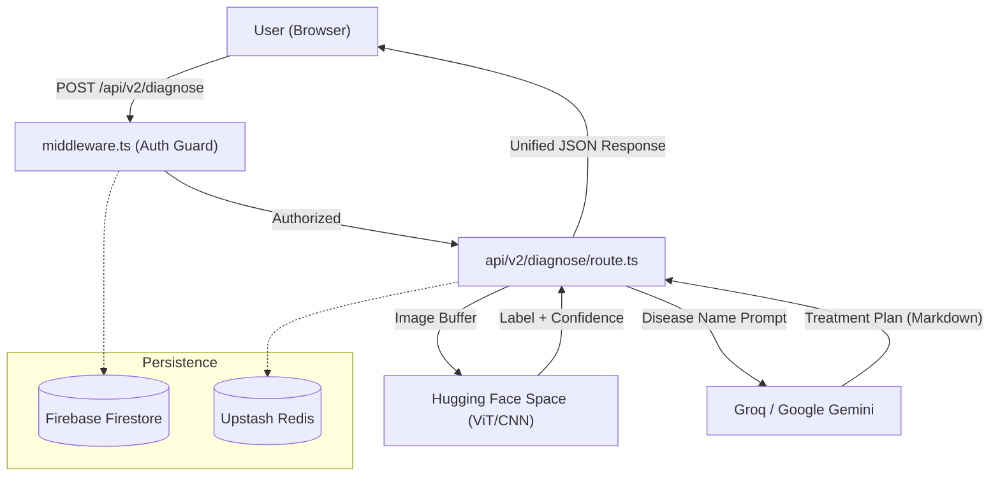

<div align="center">  
  
# 🌿 AgroLeaf AI  
  
**AI-powered crop disease detection and treatment recommendation platform**  
  
[](https://nextjs.org/)  
[](https://www.typescriptlang.org/)  
[](https://tailwindcss.com/)  
[](./LICENSE)  
  
[Live Demo](#) · [API Docs](#api-documentation) · [Report Bug](https://github.com/ByteCrister/agroleaf-ai/issues)  
  
</div>  
  
---  
  
## Overview  
  
AgroLeaf AI is a full-stack, AI-powered agricultural platform that helps farmers and agronomists identify crop diseases through leaf image analysis. It combines a **Vision Transformer (ViT/CNN)** deep learning model with **Large Language Models (LLMs)** to deliver both a disease diagnosis and actionable treatment recommendations — organic and chemical — in a single unified response.  
  
**Key metrics:**  
- 98% model accuracy across 38 disease classes  
- Sub-2s end-to-end response time  
- 7 supported crops: Rice, Tomato, Wheat, Apple, Grape, Corn, Potato  
- Mobile-first, WCAG 2.2 AA accessible UI  
  
---  
  
## Table of Contents  
  
- [Features](#features)  
- [System Architecture](#system-architecture)  
- [Tech Stack](#tech-stack)  
- [Getting Started](#getting-started)  
  - [Prerequisites](#prerequisites)  
  - [Installation](#installation)  
  - [Environment Variables](#environment-variables)  
- [Project Structure](#project-structure)  
- [API Reference](#api-reference)  
- [Design System](#design-system)  
- [Deployment](#deployment)  
- [Contributing](#contributing)  
- [License](#license)  
  
---  
  
## Features  
  
| Feature | Description |  
|---|---|  
| **AI Leaf Diagnosis** | Upload a leaf image (JPEG, PNG, BMP, WEBP, max 10MB) and receive a disease classification with confidence scores |  
| **LLM Treatment Advice** | Groq (LLaMA 3.3) or Google Gemini generates Markdown-formatted organic and chemical treatment plans |  
| **Top-3 Predictions** | Visual confidence ramp showing the top 3 most likely disease classes |  
| **Google OAuth** | One-click sign-in via Google |  
| **Email/Password Auth** | Traditional credentials with bcrypt password hashing |  
| **OTP Password Reset** | Secure time-limited OTP delivered via Gmail SMTP |  
| **Rate Limiting** | Per-user sliding-window rate limits (per-minute and per-hour) via Upstash Redis |  
| **Crop & Disease Library** | Browsable reference of all 7 crops and 38 disease classes |  
| **PWA Support** | Installable as a Progressive Web App |  
| **Glassmorphism UI** | Mobile-first frosted-glass design with Bangladesh Green identity |  
  
---  
  
## System Architecture  
  

  
### Request Lifecycle  
  
1. **Image Acquisition** — User uploads a leaf image via the `DiagnosePage` component  
2. **Client Validation** — File size (≤10MB) and MIME type are checked before submission  
3. **Auth Guard** — `proxy.ts` middleware verifies the NextAuth JWT; unauthenticated requests are redirected to `/signin`  
4. **Rate Limit Check** — Upstash Redis enforces per-user sliding-window quotas  
5. **ML Inference** — Image is forwarded to a Hugging Face Gradio Space running the ViT model  
6. **LLM Feedback** — Top-3 predictions are passed to Groq or Gemini to generate treatment advice  
7. **Response** — A unified `PredictionResponse` JSON is returned and rendered with Markdown  
  
---  
  
## Tech Stack  
  
| Category | Technology | Version |  
|---|---|---|  
| Framework | Next.js (App Router, SSR) | 16.2.3 |  
| Language | TypeScript | 5+ |  
| Styling | Tailwind CSS | v4 |  
| Auth | NextAuth.js | 4.x |  
| Database | Firebase Firestore (Admin SDK) | 13.x |  
| Cache / Rate Limit | Upstash Redis | 1.x |  
| AI — Vision | Hugging Face Gradio (ViT/CNN) | via `@gradio/client` |  
| AI — Language | Groq SDK + Google Gemini | 1.x / 1.x |  
| State Management | Zustand | 5.x |  
| Forms | React Hook Form + Zod / Yup | 7.x |  
| Animations | Framer Motion | 12.x |  
| Email | Nodemailer (Gmail SMTP) | 7.x |  
| UI Primitives | shadcn/ui + Radix UI | latest |  
| Icons | Lucide React + React Icons | latest |  
  
---  
  
## Getting Started  
  
### Prerequisites  
  
- **Node.js** 20+  
- **npm** (bundled with Node.js)  
- Accounts on: Google Cloud, Firebase, Upstash, Hugging Face, Groq, and/or Google AI Studio  
  
### Installation  
  
```bash  
# 1. Clone the repository  [header-1](#header-1)
git clone https://github.com/ByteCrister/agroleaf-ai.git  
cd agroleaf-ai  
  
# 2. Install dependencies  [header-2](#header-2)
npm install  
  
# 3. Configure environment variables (see below)  [header-3](#header-3)
cp .env.example .env.local  
  
# 4. Start the development server  [header-4](#header-4)
npm run dev  
```  
  
Open [http://localhost:3000](http://localhost:3000) in your browser.  
  
### Environment Variables  
  
Create a `.env.local` file in the project root with the following variables:  
  
```env  
# ─── NextAuth ────────────────────────────────────────────────────────────────  [header-5](#header-5)
NEXTAUTH_URL=http://localhost:3000  
NEXTAUTH_SECRET=your_random_secret_string  
  
# ─── Google OAuth ────────────────────────────────────────────────────────────  [header-6](#header-6)
GOOGLE_CLIENT_ID=your_google_client_id  
GOOGLE_CLIENT_SECRET=your_google_client_secret  
  
# ─── Firebase Admin ──────────────────────────────────────────────────────────  [header-7](#header-7)
# Paste the entire JSON content of your Firebase service account key  [header-8](#header-8)
FIREBASE_ADMIN_KEY='{"type":"service_account","project_id":"...","private_key":"...","client_email":"..."}'  
  
# ─── Upstash Redis ───────────────────────────────────────────────────────────  [header-9](#header-9)
UPSTASH_REDIS_REST_URL=https://your-instance.upstash.io  
UPSTASH_REDIS_REST_TOKEN=your_upstash_token  
  
# ─── AI Providers ────────────────────────────────────────────────────────────  [header-10](#header-10)
GROQ_API_KEY=your_groq_api_key  
GROQ_MODEL=llama-3.3-70b-versatile  
  
GEMINI_API_KEY=your_gemini_api_key  
GEMINI_MODEL=gemini-1.5-flash  
  
# ─── Email (Nodemailer / Gmail SMTP) ─────────────────────────────────────────  [header-11](#header-11)
NODEMAILER_EMAIL=your_gmail_address@gmail.com  
NODEMAILER_PASSWORD=your_google_app_password  
```  
  
> **Note:** `NODEMAILER_PASSWORD` must be a [Google App Password](https://support.google.com/accounts/answer/185833), not your regular Gmail password.  
  
---  
  
## Project Structure  
  
```  
agroleaf-ai/  
├── src/  
│   ├── app/                        # Next.js App Router  
│   │   ├── api/  
│   │   │   ├── v1/diagnose/        # Legacy proxy to FastAPI backend  
│   │   │   ├── v2/diagnose/        # Current: Gradio + LLM pipeline  
│   │   │   └── auth/[...nextauth]/ # NextAuth route handler  
│   │   ├── diagnose/               # Protected diagnosis page  
│   │   ├── layout.tsx              # Root layout (fonts, providers, metadata)  
│   │   ├── page.tsx                # Home page  
│   │   └── providers.tsx           # SessionProvider + SessionSync  
│   ├── components/  
│   │   ├── diagnose/               # DiagnosePage UI component  
│   │   └── global/                 # Header, Footer, Logo, shared UI  
│   ├── config/  
│   │   ├── firebase-admin.ts       # Firestore + Auth Admin SDK init  
│   │   ├── redis.ts                # Upstash Redis singleton  
│   │   └── nodemailer.ts           # Gmail SMTP transporter  
│   ├── lib/  
│   │   └── env.ts                  # AI provider env validation  
│   ├── stores/  
│   │   └── userStore.ts            # Zustand auth state store  
│   ├── types/                      # Shared TypeScript interfaces  
│   ├── data/                       # Static crop/disease data  
│   └── proxy.ts                    # Edge middleware (route protection)  
├── public/                         # Static assets, PWA manifest  
├── AGENTS.md                       # AI agent coding rules  
├── CLAUDE.md                       # Design system specification  
├── next.config.ts  
├── tailwind.config (via PostCSS)  
└── package.json  
```  
  
---  
  
## API Reference  
  
### `POST /api/v2/diagnose`  
  
Diagnoses a crop disease from a leaf image. Requires an authenticated session.  
  
**Request**  
  
```  
Content-Type: multipart/form-data  
Authorization: NextAuth session cookie (JWT)  
```  
  
| Field | Type | Required | Description |  
|---|---|---|---|  
| `image` | `File` | Yes | Leaf image (JPEG, PNG, BMP, WEBP, max 10MB) |  
  
**Response `200 OK`**  
  
```json  
{  
  "prediction": {  
    "predicted_class": "Tomato___Late_blight",  
    "confidence": 0.97,  
    "top3_predictions": [  
      { "class": "Tomato___Late_blight", "confidence": 0.97 },  
      { "class": "Tomato___Early_blight", "confidence": 0.02 },  
      { "class": "Tomato___healthy", "confidence": 0.01 }  
    ]  
  },  
  "ai_feedback": "## Treatment Plan\n\n### Organic\n...\n\n### Chemical\n..."  
}  
```  
  
**Error Responses**  
  
| Status | Meaning |  
|---|---|  
| `401` | Unauthenticated — no valid session |  
| `429` | Rate limit exceeded |  
| `400` | Invalid file type or missing image |  
| `500` | Inference or LLM service error |  
  
---  
  
## Design System  
  
AgroLeaf AI uses a custom **Glassmorphism Bangladesh Green** design system.  
  
| Token | Value | Usage |  
|---|---|---|  
| Primary | `#0A7B4A` | Buttons, links, focus rings |  
| Secondary | `#2C5F2D` | Hover states, depth |  
| Glass Background | `rgba(245, 250, 240, 0.6)` | Card surfaces |  
| Glass Border | `rgba(10, 123, 74, 0.25)` | Card borders |  
| Backdrop Blur | `blur(12px)` | All glass layers |  
| Focus Ring | `#0A7B4A`, 3px offset | Keyboard navigation |  
  
- **Fonts:** Plus Jakarta Sans (UI), JetBrains Mono (code)  
- **Accessibility:** WCAG 2.2 AA, keyboard-first, minimum 4.5:1 contrast ratio on all glass surfaces  
  
---  
  
## Deployment  
  
The recommended deployment target is **Vercel**.  
  
```bash  
# Production build  [header-12](#header-12)
npm run build  
  
# Start production server (self-hosted)  [header-13](#header-13)
npm start  
```  
  
**Vercel deployment checklist:**  
1. Connect your GitHub repository to Vercel  
2. Add all environment variables from `.env.local` to the Vercel project settings  
3. Set **Node.js version** to 20.x in project settings  
4. Deploy — Vercel auto-detects Next.js and configures the build  
  
> Ensure your Hugging Face Gradio Space is running and publicly accessible before deploying.  
  
---  
  
## Contributing  
  
1. Fork the repository  
2. Create a feature branch: `git checkout -b feat/your-feature`  
3. Commit your changes: `git commit -m 'feat: add your feature'`  
4. Push to the branch: `git push origin feat/your-feature`  
5. Open a Pull Request  
  
Please follow the existing code style (ESLint + TypeScript strict mode) and ensure `npm run lint` passes before submitting.  
  
---  
  
## License  
  
This project is licensed under the **MIT License** — see the [LICENSE](./LICENSE) file for details.  
  
---  
  
<div align="center">  
Built with Next.js, Hugging Face, and Groq · Designed for farmers, agronomists, and the future of agriculture  
</div>